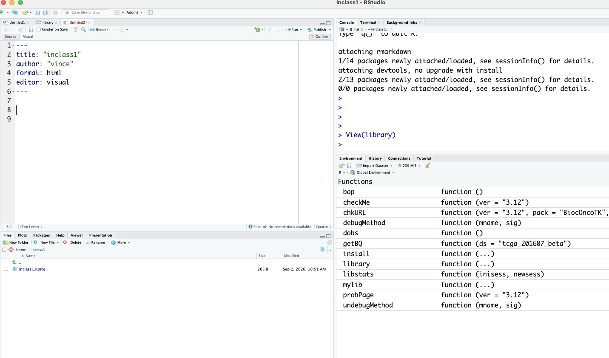

# Overview

The purpose of this document and repo is to illustrate how
to complete a problem set for BST 260.  Our example problem set
is the [first from 2025](https://vjcitn.github.io/2026vjc/psets/pset-01-unix-quarto.html).

The problem set has numbered instructions and tells you to create
the file "beginning.qmd".  So that is the name of this file.

We will use section headings with "Exercise [k]" to provide
solutions to the exercises.

# Exercise 1

The file is created.

# Exercise 2

The screenshot of the session is included.



# Exercise 3

[Explain as much as you can concerning your approach to answering the exercise.]

We define constants that will be used as coefficients in a quadratic function
$f(x) = ax^2 + bx + c$.
```{r const}
a = 1
b = -1
c = -2
```
We are asked to acquire the solutions to $f(x) = 0$.  The solutions are,
using the classic "quadratic formula" of elementary algebra:
```{r sol1}
(-b + sqrt(b^2 - 4*a*c))/(2*a)
```
and
```{r sol2}
(-b - sqrt(b^2 - 4*a*c))/(2*a)
```

# Exercise 4

Because the constants a, b, c have values in the environment
used for this document, we can write

```{r ex4}
f = function(x) a*x^2 + b*x +c
```

and then produce the desired plot:

```{r ex4b}
xrng = seq(-5,5,length=100)
plot(xrng, f(xrng))
abline(h=0)
```

# Exercise 5

```{r ex5}
dir.create("docs")
```

Do the steps in Rstudio necessary to create the pdf of this
document.  Once it is done, copy it to the folder you just made,
and show the commands you used.

# Exercise 6

The problem set specifies how to create a folder and file within it.  These
commands in R are equivalent.

```{r ex6}
dir.create("data")
```

# Exercise 7

```{r ex7}
coefs = c(1,-1,-2)
writeLines(as.character(coefs), con="data/coefs.txt") # why?
```

# Exercise 8 and beyond

As written these elements address creating and moving files
using the UNIX shell.  Let's just solve the problem
in this markdown.

These commands overwrite the previous values of a, b, c.
```{r fin}
newcoefs = as.numeric(readLines("data/coefs.txt"))
a = newcoefs[1]
b = newcoefs[2]
c = newcoefs[3]
sol1 = (-b + sqrt(b^2 - 4*a*c))/(2*a)
sol2 = (-b - sqrt(b^2 - 4*a*c))/(2*a)
print(c(sol1, sol2))
```

There are other ways to write and read the coefficients.  `writeLines`
is specifically for writing text, and we had to coerce our coefficients
to character to use this.  Another approach would be to use `cat` and `scan`.
